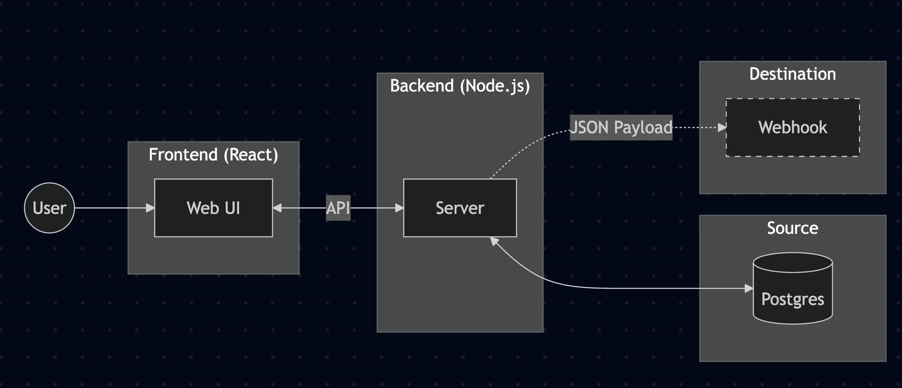

# Take-Home Assignment: Setup Reverse ETL to Webhook

## Context

Reverse ETL is the process of syncing data from a company's data warehouse to operational systems and SaaS tools—turning analytical data into action. While data warehouses centralize valuable customer insights (LTV, churn likelihood, engagement scores), this data is often locked away, accessible only to technical SQL users.

Reverse ETL unlocks this data activation by putting the right data in the right operational tools—CRMs, marketing platforms, support systems, and more.

A typical Reverse ETL pipeline consists of:

- **Source:** A data warehouse (e.g., Postgres, Snowflake, BigQuery) containing the data you want to sync
- **Import data:** The specific table or model to extract from the source
- **Mapping:** How source data transforms into the destination's expected format
- **Destination:** The operational system receiving the data (e.g., Salesforce, Iterable, a webhook)

You're building a simplified version of the setup flow for this pipeline—where a user configures their source, selects data to import, defines the mapping, and previews the output before syncing.

## Business Requirements

Build a web application that allows a user to:

1. Connect to their Postgres database using a connection string, with the ability to verify the connection works
2. Select a table they want to sync from
3. Map columns to JSON fields — users should be able to define how each column maps to the output JSON, including nested fields (e.g., `first_name → user.name.first`)
4. Preview the output — select a limited number of rows and see the resulting JSON payload that would be sent to a webhook destination

## Technical Requirements

- **Frontend:** A web UI built with React and TypeScript where users complete the setup flow
- **Backend:** A Node.js server (TypeScript) that handles all database connectivity — the frontend must never connect directly to Postgres
- **Frontend ↔ Backend:** Communication must happen via an API. The design of this API is up to you and will be part of the evaluation.
- Postgres is the only source you need to support
- No authentication required
- No persistence required (configuration doesn't need to survive a page refresh)
- No actual sync execution needed—just preview the transformed output

## Getting Started

We provide a project template that includes a Docker Compose setup with a seeded Postgres database. This ensures a consistent development environment and lets you focus on the application itself.

## Time Expectation

We're respectful of your time. Aim to complete between 3-6 hours — we've scoped this assignment accordingly and do not expect more. We value pragmatic trade-offs over polish.

## What We're Looking For

| Area | What we Evaluate |
|---|---|
| Translation of requirements | Ability to turn business needs into a working technical solution |
| Code quality | Readable, well-structured code with reasonable TypeScript usage |
| Product thinking | UX decisions, error handling, edge cases |
| Technical judgment | Sensible architecture decisions for the given scope |
| Pragmatism | A functional solution over a perfect partial one |
| Extensibility | Code structured to accommodate future changes, without premature abstraction |

## AI Usage

Using LLMs for this assignment is expected. Our expectation is that you have reviewed, fully understand, and own the code you submit. Avoid AI slop, redundant code, and excessive comments. The code needs to be readable and maintainable by a human.

## Deliverables

1. A public GitHub repository (or zip file) with your solution
2. Update the README with:
   - Instructions to run the project
   - Any assumptions you made
   - What you would improve given more time
